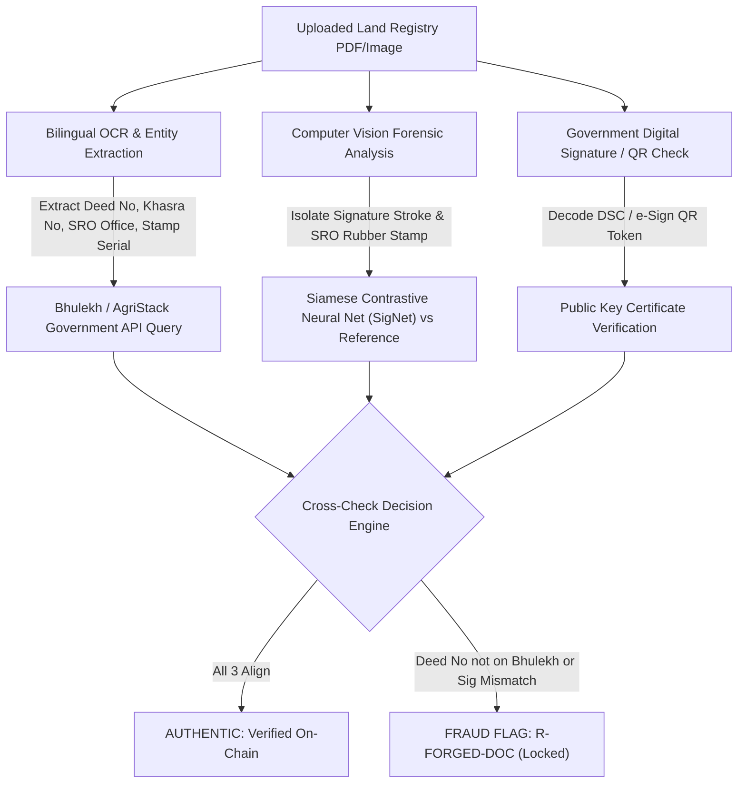
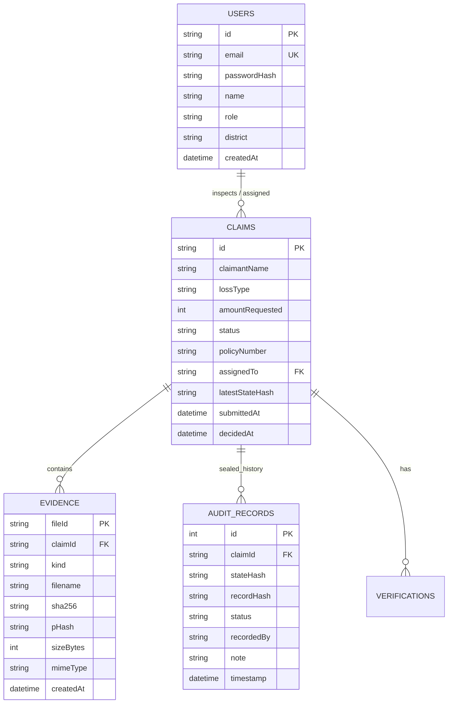

# Architecture & Implementation Plan: Insurer Auth, Database System & Security Framework

> **Status:** APPROVED FOR PLANNING — AWAITING USER CONFIRMATION TO EXECUTE.  
> **Author:** Antigravity AI  
> **Date:** 2026-09-23  
> **File:** `INSURER_AUTH_DB_SECURITY_PLAN.md`

This document details the architectural plan, database schema, authentication system, and security framework for **ClaimChain**. Any future AI model resuming this project must read this document and `CLAIMCHAIN_CONTEXT.md` before writing code.

---

## 1. Security & Forensics Specifications (Direct Questions Answered)

### Q3: How do we ensure signatures on land registry papers are genuine and not forged?

Land registry documents in India (*विक्रय विलेख, खतौनी, खसरा, 7/12*) contain multiple physical and cryptographic security layers. In a production micro-insurance fraud pipeline, authenticity is verified via **triangulation across three independent layers**:

1. **State Land Registry API Triangulation (Bhulekh / AgriStack / CERSAI):**
   * Physical ink signatures can be forged or photocopied, but **Deed Registration Numbers, Khasra/Khatauni Numbers, and Sub-Registrar Office (SRO) volume numbers** cannot be faked on the government ledger.
   * ClaimChain extracts the SRO registration code and queries state land portals (e.g., Mahabhulekh, UP Bhulekh, AgriStack registry). If the deed number does not match the official record for that parcel and owner, it is flagged immediately as `R-FORGED-REGISTRY`.
2. **Deep Learning Signature & Stamp Verification (SigNet / Computer Vision):**
   * **Stamp & Seal Geometry:** OpenCV and YOLO models detect the official embossed government seal and Sub-Registrar rubber stamp.
   * **Stroke Biometrics:** A Siamese Neural Network (trained on offline signature verification datasets like CEDAR / BHSig260) isolates the claimant's signature strokes and compares baseline stroke thickness, pressure curvature, and line fluidity against baseline signatures (from Aadhaar e-Sign or bank mandate).
3. **Cryptographic e-Sign / Digital Signature (DSC) Validation:**
   * Modern digitized land records issued by State Revenue Departments contain a cryptographic 2D QR code or PKI digital signature. The system parses the PKCS#7 digital signature using the state government's public key certificate.

---

### Q4: How do we prevent data breaches when Aadhaar and Registry papers are uploaded?

ClaimChain uses a **Defense-in-Depth** security architecture compliant with UIDAI regulations and India's Digital Personal Data Protection (DPDP) Act:

1. **Zero-Knowledge Blockchain Principle (No PII on Chain):**
   * **The blockchain NEVER stores personal data, names, images, or Aadhaar numbers.**
   * It only seals SHA-256 mathematical hashes (`stateHash`). A hash is irreversible; even if someone inspects the entire Polygon ledger, they cannot reconstruct the Aadhaar card or document.
2. **Mandatory Aadhaar Masking at the Ingestion Gateway:**
   * Per UIDAI guidelines, storing raw 12-digit Aadhaar numbers is illegal for private entities.
   * The server-side OCR engine redacts and masks the first 8 digits immediately upon file ingestion (`XXXX XXXX 4533`). The raw 12-digit number is never stored in the database or written to disk.
3. **Envelope Encryption at Rest (AES-256-GCM):**
   * All uploaded evidence files (photos, bills, registry scans) are encrypted using AES-256-GCM before writing to the storage volume.
   * Even in the event of an unauthorized server disk clone or file leak, the files are unreadable ciphertext without the Hardware Security Module (HSM) / KMS master key.
4. **Time-Limited, Signed Access URLs & Strict RBAC:**
   * File endpoints (`/api/evidence/:fileId`) are protected behind authenticated sessions.
   * Direct public links do not exist; files can only be accessed with short-lived (5-minute) cryptographic tokens issued only to the assigned inspector.

---

## 2. Feature 1: Working Auth System for Insurers / Inspectors

### Design & Roles
* Pre-configured inspector accounts with distinct coverage areas and roles:
  * **Inspector 1 (Senior Fraud Investigator):** `inspector1@claimchain.gov.in` (Region: Maharashtra - Yavatmal / Nanded)
  * **Inspector 2 (Micro-claims Officer):** `inspector2@claimchain.gov.in` (Region: Maharashtra - Nashik / Pune)
  * **Inspector 3 (Auditor / Supervisor):** `supervisor@claimchain.gov.in` (Full review / override authority)
* **Authentication Mechanism:**
  * Password hashing via `bcrypt` (salt rounds: 10).
  * Stateless, secure JWT (JSON Web Tokens) passed via `Authorization: Bearer <token>` or HTTP-only cookies.
  * Express Auth Middleware (`requireAuth`, `requireRole`) protecting claims actions, reviews, and payouts.
* **Frontend Experience:**
  * Dedicated **Insurer Login Screen** (`/login`) with instant demo credentials pre-fill buttons for quick judge evaluation.
  * Header User Profile Badge showing the active logged-in inspector (`Inspector 1 · Yavatmal`), role chip, and **Logout** button.

---

## 3. Feature 2: Relational Database System & Insurer History Views

### Database Engine Choice: SQLite via Better-SQLite3 / Prisma
* **Why SQLite:** Embedded, zero external dependencies, file-backed, ultra-fast (sub-millisecond queries), runs identically on local Mac and cloud environments without needing an external PostgreSQL container. (Can be swapped to Postgres in 1 line via Prisma if needed).

### Database Schema

### Insurer History & Filterable Dashboard
* **Insurer Dashboard Tabbed Listing:**
  * **All Claims** (Total count and chronological history)
  * **Auto-Approved** (Passes all 7 stages, ready for UPI payout)
  * **Flagged / Locked** (Requires human review with mandatory ≥20-character reason)
  * **Rejected** (Failed validation, forged docs, or staged damage)
  * **Paid** (Completed payouts with transaction reference)
* **Search & Inspector Filters:**
  * Instant search by **Claim ID**, **Claimant Name**, or **Policy Number**.
  * Filter by **Assigned Inspector** or **Loss Type** (Flood, Drought, Livestock).

---

## 4. Implementation Steps (To be executed upon approval)

1. **Step 1 — Database Layer (`server/src/db/`):**
   * Initialize SQLite schema with migration scripts.
   * Create repositories for `User`, `Claim`, `Evidence`, and `AuditRecord`.
2. **Step 2 — Auth API & Seed Inspectors (`server/src/auth/`):**
   * Implement `/api/auth/login`, `/api/auth/me`, `/api/auth/logout`.
   * Seed `inspector1`, `inspector2`, and `supervisor`.
3. **Step 3 — Filtered History Endpoints (`server/src/index.ts`):**
   * Enhance `GET /api/claims` with query filters: `?status=...&inspector=...&search=...`.
4. **Step 4 — Web Frontend Integration (`web/src/`):**
   * Build login modal/page and auth context (`useAuth`).
   * Add Status Filter Tabs (Approved / Flagged / Rejected / Paid) and Inspector history selector in Console.
5. **Step 5 — Verification & Documentation:**
   * Test complete auth flow, status filtering, and verify all claims in DB.
   * Update `CLAIMCHAIN_CONTEXT.md` with all changes.
