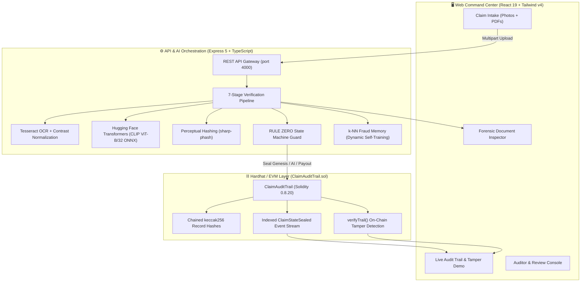

<div align="center">

# 🌾 ClaimChain

### **Next-Gen Micro-Insurance Claims with Authentic Document Intelligence & Immutable Blockchain Audit Trails**

*Engineered for Smart India Hackathon (SIH) · Built for Indian Farmers & Rural Beneficiaries*

<br/>

[](https://soliditylang.org/)
[](https://react.dev/)
[](https://www.typescriptlang.org/)
[](https://vitejs.dev/)
[](https://tailwindcss.com/)
[](https://expressjs.com/)
[](https://hardhat.org/)
[](https://huggingface.co/)

<br/>

[Overview](#-overview) •
[System Architecture](#-system-architecture) •
[AI Verification Pipeline](#-ai-verification-pipeline) •
[Immutable Blockchain Ledger](#-immutable-blockchain-audit-trail) •
[Key Innovations](#-key-innovations) •
[Getting Started](#-getting-started) •
[Demo Flow for Evaluators](#-demo-flow-for-judges--evaluators)

---

</div>

## 📌 Overview

Rural crop micro-insurance programs (such as **PMFBY**) process millions of smallholder farmer claims (typically ₹1,000–₹10,000). Historically, insurers faced a difficult dilemma:
- **Painful Claim Delays**: Weeks of manual field surveying, paperwork backlogs, and slow verification leave vulnerable farmers in distress during weather catastrophes.
- **Rampant Fraud & Claim Leakage**: Fabricated damage imagery, recycled photos across different districts, doctored land records, and retroactive internal ledger tampering.

**ClaimChain** solves both problems simultaneously:
1. **Under-60-Second Auto-Verification**: Multimodal AI parses land registries, Aadhaar cards, and damage photos locally on CPU without external API dependencies.
2. **Cryptographic Proof of Authenticity**: Every intake event, AI log digest, human review decision, and payout is sealed into an immutable, hash-chained smart contract ledger.

---

## 🏛 System Architecture

ClaimChain is structured as a tightly orchestrated monorepo comprising three specialized modules:



---

## 🧠 AI Verification Pipeline

ClaimChain computes verdicts algorithmically. Every claim traverses an automated **7-stage forensic pipeline**:

```
[ Upload Evidence ]
        │
        ▼
┌─────────────────────────┐
│ 1. EXIF & Integrity     │ ──► Checks camera hardware, software edit tags (Photoshop/Canva), & GPS validity.
└───────────┬─────────────┘
            ▼
┌─────────────────────────┐
│ 2. Perceptual Hash      │ ──► Sharp-pHash computes Hamming distance across all historic claims (d ≤ 6 flags duplicate imagery).
└───────────┬─────────────┘
            ▼
┌─────────────────────────┐
│ 3. Document OCR & NLP   │ ──► Tesseract OCR (bilingual EN/HI) with adaptive contrast normalization (1400px upscale).
└───────────┬─────────────┘
            ▼
┌─────────────────────────┐
│ 4. Policy Matching      │ ──► Cross-references extracted policy number, sum insured, and covered perils (PMFBY format).
└───────────┬─────────────┘
            ▼
┌─────────────────────────┐
│ 5. Vision & Damage      │ ──► Local CLIP ViT-B/32 ONNX executes 3 zero-shot detectors:
│                         │     1. Visual loss-type relevance (detects unrelated pictures)
│                         │     2. Screen-recapture / staged photo detection
│                         │     3. AI-generated / synthetic image detector
└───────────┬─────────────┘
            ▼
┌─────────────────────────┐
│ 6. Anti-Fraud Rules     │ ──► R4 GPS-district geo-fencing (haversine formula against regional centroids) + k-NN memory score.
└───────────┬─────────────┘
            ▼
┌─────────────────────────┐
│ 7. Weighted Decision    │ ──► Aggregates stage penalties into a score (0–100) & emits evidence-grounded bilingual explanations.
└─────────────────────────┘
```

### Forensic Document Intelligence
- **Multi-Document Extraction**: Recognizes **Sale Deeds / Khatauni** (`विक्रय विलेख`, `खतौनी`), **Khasra / Plot Numbers** (`खसरा नं०`), **Land Area / Rakba** (`रकबा`), **District/Village**, **Aadhaar Names & UID**, and **Policy Limits**.
- **Devanagari Transliteration & Fuzzy Matching**: Uses Levenshtein metric and Devanagari-to-Latin phonetic transliteration to verify identity between Hindi land documents and English policy/ID records.
- **Zero Cloud Costs**: All vision and OCR models run locally in-process on CPU via ONNX Runtime and WebAssembly.

---

## ⛓️ Immutable Blockchain Audit Trail

All claim states are sealed on-chain via `ClaimAuditTrail.sol` using **cryptographic hash chaining**:

$$\text{recordHash}_n = \text{keccak256}\Big(\text{recordHash}_{n-1},\, \text{stateHash},\, \text{status},\, \text{timestamp},\, \text{signer},\, \text{keccak256}(\text{note})\Big)$$

### Mathematical Tamper Detection
- If an attacker or corrupt insider modifies a single byte in a historical record (e.g. changing payout from ₹4,500 to ₹15,000), the hash chain breaks from that block forward.
- The smart contract function `verifyTrail(bytes32 claimId)` computes the exact index where the chain was broken:
  ```solidity
  function verifyTrail(bytes32 claimId) external view returns (bool valid, uint256 brokenAtIndex);
  ```

---

## ⚡ Key Innovations

| Feature | Description |
| :--- | :--- |
| **🛡️ Rule Zero Payout Lock** | Flagged claims cannot be paid (`409 FLAGGED_LOCKED`). Only `AI_APPROVED` or `HUMAN_APPROVED` claims unlock the UPI payment rails. |
| **🔒 Computed Verdicts** | Verdicts (`AI_APPROVED`, `AI_FLAGGED`, `AI_REJECTED`) are strictly computed by the pipeline. Manual injection returns `403 AI_VERDICTS_ARE_COMPUTED`. |
| **🔍 Forensic Doc Inspector** | Full modal UI to view raw Tesseract OCR output, copy extracted text, inspect confidence ratings, and review name match scoring. |
| **🧠 Continuous k-NN Learning** | Evaluated claim embeddings are enrolled into local vector memory. Human review resolutions re-label samples to improve fraud detection over time. |
| **💥 Live Tamper Simulation** | Interactive UI demonstrating real-time storage manipulation and instantaneous on-chain tamper detection with one-click restore. |
| **🌐 Bilingual Transparency** | Explainable AI generates reasoning in both English and Hindi citing specific evidence points. |

---

## 🚀 Getting Started

### Prerequisites
- **Node.js** >= v20.x
- **npm** >= 10.x

### Quick Installation & Launch

Run the entire ecosystem with a single command from the project root:

```bash
# 1. Clone repository
git clone https://github.com/utkarshvijay1717lk/ClaimChain-SIH.git
cd ClaimChain-SIH

# 2. Install all dependencies (web, server, blockchain)
npm run install:all

# 3. Launch complete demo stack (Hardhat node + Deploy + API + Web Dashboard)
npm run demo
```

Once launched, access the interfaces:
- 🖥️ **Web Dashboard**: `http://localhost:5173`
- 📡 **REST API & Health**: `http://localhost:4000/api/health`
- ⛓️ **Hardhat Local EVM**: `http://127.0.0.1:8545`

---

## 🧪 Demo Flow for Judges & Evaluators

Follow this sequence to test ClaimChain's end-to-end capabilities:

1. **Live Claims Queue & Intake**:
   - Navigate to `http://localhost:5173/console`.
   - Toggle between **Live Only** and **All Claims** to distinguish fresh submissions from seeded benchmark claims.
   - Use the **Intake Form** to upload damage photos, an Aadhaar card, and a PMFBY policy document.
2. **Watch the Automated Pipeline**:
   - The 7-stage stepper computes execution timings in real time without mock delays.
   - Click **"Inspect Documents"** to open the **Forensic Document Inspector Modal**:
     - Review **Extracted Entities** (Khasra numbers, district, buyer name, sum insured).
     - Inspect **Raw OCR Text** extracted directly from your files.
     - Review **Identity Cross-Check** transliteration and similarity scores.
3. **Pervasive Anti-Fraud (Rule Zero)**:
   - Select flagged claim **`CLM-8919`** (triggered by duplicate pHash collision against historical archived claim `CLM-4102`).
   - Attempt payout: The system strictly denies payment with a **`409 FLAGGED_LOCKED`** guard.
   - Review the claim in the human review lane with a mandatory justification note to approve.
4. **Interactive Tamper Proof**:
   - In the **Audit Trail** panel, click **"Attempt Retro-Edit"**.
   - The system performs storage manipulation directly on the blockchain node.
   - The audit trail instantly breaks: `verifyTrail` catches the forgery and highlights the exact compromised block index.
   - Click **"Restore"** to reset state and witness the chain re-verify to 100% cryptographic integrity.

---

## 📦 Directory Structure

```text
ClaimChain-SIH/
├── package.json                 # Root convenience runner
├── boot_backend.sh              # Headless backend launcher
└── claimc-main/
    ├── blockchain/              # Hardhat EVM workspace
    │   ├── contracts/           # ClaimAuditTrail.sol (Solidity 0.8.20)
    │   ├── scripts/             # Deployment scripts
    │   └── test/                # Hardhat test suite (12/12 passing)
    ├── server/                  # Express 5 API & AI Engine
    │   ├── src/ai/              # OCR, CLIP ONNX, pHash, Geo, & Pipeline
    │   ├── src/chain/           # ethers.js v6 contract client & tamper demo
    │   └── src/index.ts         # REST routes, guards, & persistence
    ├── web/                     # React 19 Frontend SPA
    │   ├── src/pages/           # Console, Explorer, Integrity, Memory, Pipeline
    │   └── src/components/      # UI primitives & Forensic Inspector
    └── scripts/                 # demo.sh one-command launcher
```

---

## 👥 Smart India Hackathon (SIH) Team

Developed with ❤️ for rural empowerment, transparent governance, and fraud-free crop insurance.
